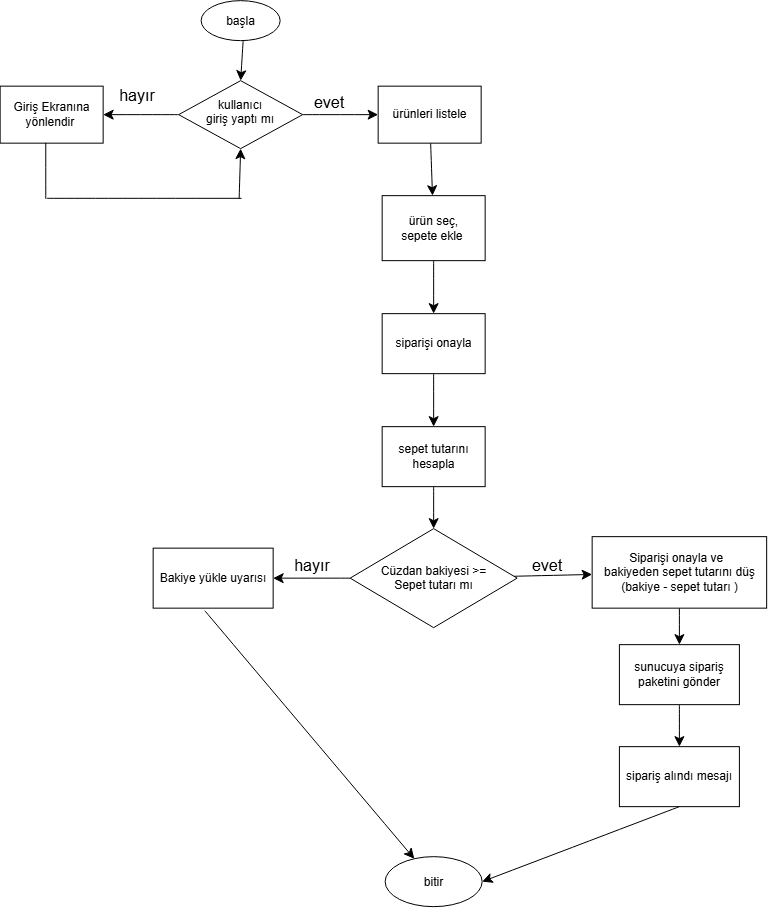

# GÖREV 1: MOBİL AKIŞ ŞEMASI (FLOWCHART)
 

# GÖREV 2: REST API UÇ NOKTASI & JSON TASARIMI

1. Sipariş Oluşturma Endpointi
-HTTP metodu : POST //çünkü yeni birşey oluşturuyoruz.
-Endpoint: /api/v1/siparisler
-Header : Authorization: Bearer <token>
          Content-Type: application/json
-Request Body: {
    "kahveAdi": "Americano",
    "kahveBoyu": "Grande",
    "adet": 3,
    "tutar": 355.75
}
-Başarılı sonuç : 201 Created
-Kullanıcı giriş yapmadıysa : 401 Unauthorized 

2. Cüzdan Bakiye Sorgulama Endpointi 
-HTTP metodu : Get //çünkü yeni veri oluşturmuyoruz var olanı gösteriyoruz
-Endpoint: /api/v1/kullanici/bakiye
-Örnek response body: {
    "bakiye": 200.00,
    "paraBirimi": "TRY"
}
-Sunucuda beklenmeyen hata oluşursa : 500 Internal Server Error

Mini Mülakat Sorusu
Yukarıdaki GET ve POST isteklerinden hangisi Idempotent (Eşgüçlü) bir istektir, hangisi değildir? Neden?
--> Get idempotenttir çünkü aynı isteği tekrarlarsak veri değişmez aynı veri gelip durur. Ama Post idempotent değildir çünkü aynı isteği tekrarladığımızda yeni siparişler oluşur.

# GÖREV 3: CLEAN CODE & SOLID PRENSİP TEŞHİSİ

1. Soru 
-Bu kodda birden fazla sorumluluk tek bir sınıfa yüklendiği için SRP ihlali yapılmış. Sınıfı sepetHesaplayici, odemeYoneticisi, siparisKaydetme ve smsServisi gibi küçük parçalara bölmeliyiz.

2. Soru 
-Open/Closed Prensipine aykırıdır. (Gelişmeye açık/Değişmeye kapalı).